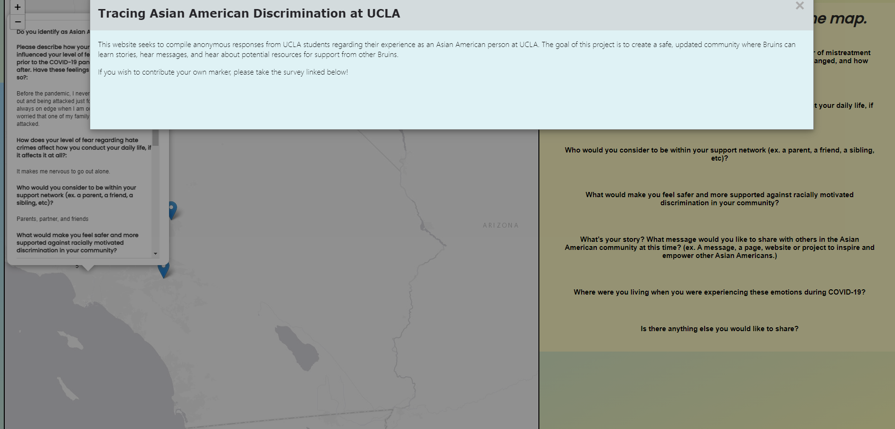
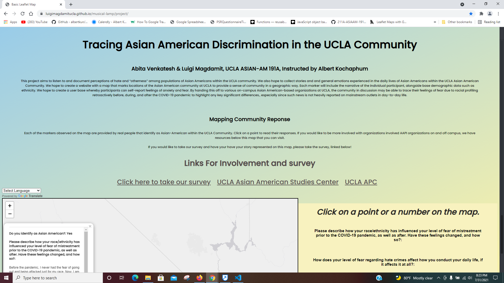

# Tracing Asian American Discrimination in the UCLA Community
> his project aims to listen to and document perceptions of hate and “otherness” among populations of Asian Americans within the UCLA community. We also hope to collect stories and and general emotions experienced in the daily lives of Asian Americans within the UCLA Asian American Community. We hope to create a website with a map that marks locations of the Asian American community at UCLA to provide a sense of community in a geographic way. Each marker will include the narrative of the individual participant, alongside base demographic data such as ethnicity. We hope to create a user base whereby participants can self-report feelings of anxiety and fear. By handing this off to various on-campus Asian American-based organizations at UCLA, the community in discussion may be able to trace their feelings of fear due to racial profiling retroactively before, during, and after the COVID-19 pandemic to highlight any key significant differences., especially since such news is not heavily reported on mainstream outlets in day-to-day life.
> Live demo [_here_](https://luigimagdamitucla.github.io/musical-lamp/project/). <!-- If you have the project hosted somewhere, include the link here. -->

## Table of Contents
* [Objective](#objective)
* [Technologies Used](#technologies-used)
* [How it can be repurposed](#how-it-can-be-repurposed)
* [Screenshots](#screenshots-and-features)
* [Acknowledgements](#acknowledgements)
* [Contact](#contact)
<!-- * [License](#license) -->

## Objective
-Who is being empowered?
-Asian American students at UCLA are being empowered through this website because they are able to anonymously share their own stories and messages in the amount of detail that they feel comfortable with. In this way, this webpage is solely for students by students.
<!-- You don't have to answer all the questions - just the ones relevant to your project. -->

## Technologies Used
- Google Forms
- Google Sheets
- Javascript
## File Structure
-The root folder holds the index.html. The sub-folders “js” and “styles” hold the logic and the styling of the website respectively

## How it can be repurposed
-This project will be sent/handed off to various clubs at UCLA that are relevant to the project at hand; for example, those that are APC-associated. The survey is currently already send to KASA, Hawaii Club, and APC 2020-2021 staff, and as school starts up in fall quarter and clubs are more active, we hope to send our website and connect to more organizations.

-The information on this website can be used as a source of support, a way to find different resources, and share stories with other Bruins. Perhaps if some shared messages and links gain traction, they will allow more students to learn about resources not ordinarily brought to light.

-Learning more about Bruin stories can also help the general student population increase understanding of the experiences of certain marginalized groups at UCLA, whereby before they would not have heard these stories. For example, this survey is centered around the experiences of Asian American students, and within that group there are many other minority groups that can learn from and about each other.

## Screenshots and Features
-When you open the webpage, the user is able to see a brief description of the purpose of the webpage, and they are informed about the survey and opportunity to share their own marker on the map.

-This webpage clearly displays the project objective at the forefront right underneath the title, and it also describes what each marker represents/the community response for clarity. As you click on each marker, survey responses are displayed clearly to the side for ease of reading.

-There are also links to take the survey, to the Asian American Studies Center where students can access even more links to resources and research, and to APC displayed on the webpage, where students can learn more about student-specific events and news with associated organizations.

-The website also offers language translation for ease of use.
-The link that says “Click here to take the survey” leads you to the google form where you can fill out answers to add a marker to the map.

<!-- If you have screenshots you'd like to share, include them here. -->

## Acknowledgements
-Thanks to Albert, who supervised our project

-Thanks to the survey takers

-Thanks to all involved with helping out with survey data!

## Contact
luigiantonmagdamit@gmail.com & abitav.2000@gmail.com

<!-- You don't have to include all sections - just the one's relevant to your project →
